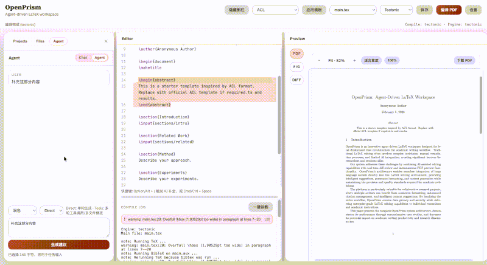
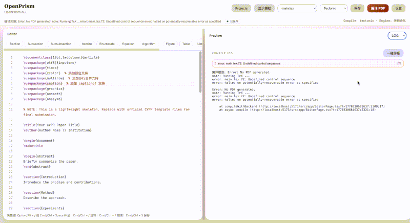
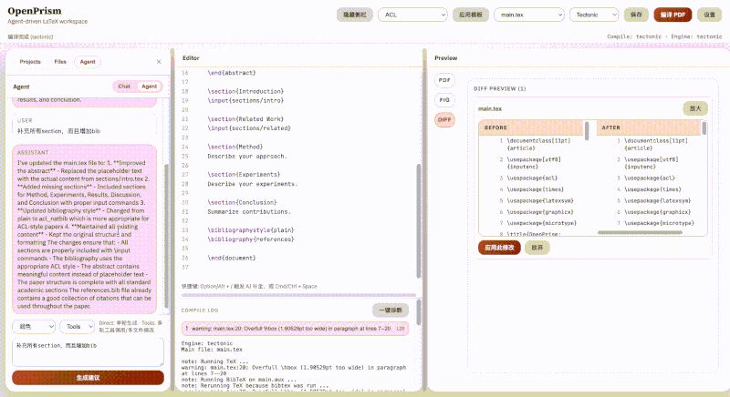

<div align="center">


# OpenPrism

### OpenPrism — Vibe Writing for Academia

[](https://nodejs.org/)
[](LICENSE)
[](https://github.com/yourusername/OpenPrism/stargazers)
[](https://github.com/yourusername/OpenPrism/network/members)

[中文](README.md) | [English](README_EN.md)

---

### ✨ Highlights

| 🤖 AI Assistant | ✍️ Compile & Preview | 📚 Templates |
|:---:|:---:|:---:|
| Chat / Agent history<br>Tools multi-step edits | TexLive / Tectonic / Auto<br>PDF preview & download | ACL / CVPR / NeurIPS / ICML<br>One-click conversion |

| 🔧 Advanced Editing | 🗂️ Project Management | ⚙️ Configuration |
|:---:|:---:|:---:|
| AI autocomplete / Diff / diagnose | Multi-project + file tree + upload | OpenAI-compatible endpoint<br>Local-first privacy |

| 🔍 Search | 📊 Charting | 🧠 Recognition |
|:---:|:---:|:---:|
| WebSearch / PaperSearch | Chart from tables | Formula/Chart recognition |

---

<a href="#-quick-start" target="_self">
  
</a>
<a href="#-core-features" target="_self">
  
</a>
<a href="#-contributing" target="_self">
  
</a>
<a href="#wechat-group" target="_self">
  
</a>

</div>

---

<div align="center">
<br>

<br>
<sub>✨ Home preview: three-panel workspace + editor + preview</sub>
<br><br>
</div>

---

## ✨ Core Features

OpenPrism is a local-first LaTeX + AI workspace for academic writing, optimized for fast editing, controlled changes, and privacy.

### 🤖 AI Assistant

- **Chat mode**: read-only Q&A
- **Agent mode**: generate diffs for confirmation
- **Tools mode**: multi-step tools + multi-file edits
- **Tasks**: polish, rewrite, restructure, translate, custom
- **Autocomplete**: Option/Alt + / or Cmd/Ctrl + Space, Tab to accept

### ✍️ Compile & Preview

- **Engines**: TexLive / Tectonic / Auto fallback
- **Preview toolbar**: zoom, fit width, 100%, download PDF
- **Compile log**: error parsing + one-click diagnose + jump to error
- **Views**: PDF / Figures / Diff

### 📚 Template System

- **Built-ins**: ACL / CVPR / NeurIPS / ICML
- **Conversion**: one-click template switch with content preserved

### 🗂️ Project Management

- **Projects panel**: manage multiple projects
- **File tree**: create/rename/delete/upload/drag
- **BibTeX**: quick create `references.bib`

### ⚙️ Configuration

- **LLM Endpoint**: OpenAI-compatible, supports custom base_url
- **Local storage**: settings saved to browser localStorage
- **TexLive config**: customizable TexLive resources
- **Language switch**: toggle 中文/English in the top bar

### 🔍 Search & Reading

- **WebSearch**: online search with summaries
- **PaperSearch**: academic paper search with citation info

### 📊 Charts & Recognition

- **Table-to-chart**: generate charts directly from tables
- **Smart recognition**: formulas and charts auto-detected

---

## 🎨 Showcase

### 🖥️ Three-Panel Workspace

<div align="center">
<br>

<br>
<sub>✨ AI Assistant | LaTeX Editor | PDF Preview</sub>
<br><br>
</div>

### ✍️ Editor View

<div align="center">
<br>

<br>
<sub>✨ Synchronized editing and preview</sub>
<br><br>
</div>

### 🤖 Agent Mode

<div align="center">
<br>

<br>
<sub>✨ Generate diff suggestions for review</sub>
<br><br>
</div>

### 🧪 One-Click Diagnose

<div align="center">
<br>

<br>
<sub>✨ Parse compile errors and jump to locations</sub>
<br><br>
</div>

### 🌐 WebSearch

<div align="center">
<br>
<!-- TODO: add WebSearch showcase image -->
<sub>✨ Online search with concise summaries</sub>
<br><br>
</div>

### 📄 PaperSearch

<div align="center">
<br>
<!-- TODO: add PaperSearch showcase image -->
<sub>✨ Academic search and citation info</sub>
<br><br>
</div>

### 📊 Table-to-Chart

<div align="center">
<br>
<!-- TODO: add table-to-chart showcase image -->
<sub>✨ Turn tables into charts in one step</sub>
<br><br>
</div>

### 🧠 Formula/Chart Recognition

<div align="center">
<br>
<!-- TODO: add recognition showcase image -->
<sub>✨ Recognize structures for editable outputs</sub>
<br><br>
</div>

### 🔧 AI Autocomplete

<div align="center">
<br>

<br>
<sub>✨ Option/Alt + / to trigger, Tab to accept</sub>
<br><br>
</div>

### 🧾 Diff Preview

<div align="center">
<br>

<br>
<sub>✨ Side-by-side diff with full-screen view</sub>
<br><br>
</div>

---

## 🚀 Quick Start

### Requirements

- **OS**: Windows / macOS / Linux
- **(Optional) Tectonic**: enable server-side compile

### Install & Run

```bash
# 1. clone
git clone https://github.com/yourusername/OpenPrism.git
cd OpenPrism

# 2. install
npm install

# 3. dev server (frontend + backend)
npm run dev
```

Open:
- Frontend: http://localhost:5173  
- Backend: http://localhost:8787

---

## 📁 Project Structure

```
apps/
  frontend/          # React + Vite
  backend/           # Fastify API / compile / LLM agent
templates/           # LaTeX templates
data/                # runtime project storage
```

---

## 🤝 Contributing

PRs welcome. Please include a brief summary and screenshots for UI changes.

---

## 📄 License

MIT

---

<div align="center">

**If this project helps you, please give us a ⭐️ Star!**

[](https://github.com/yourusername/OpenPrism/stargazers)
[](https://github.com/yourusername/OpenPrism/network/members)

<br>

<a name="wechat-group"></a>

<br>
<sub>Scan to join the community WeChat group</sub>

<p align="center">
  <em>Made with ❤️ by OpenPrism Team</em>
</p>

</div>
