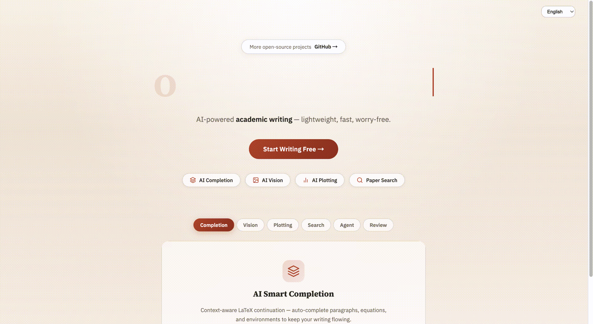
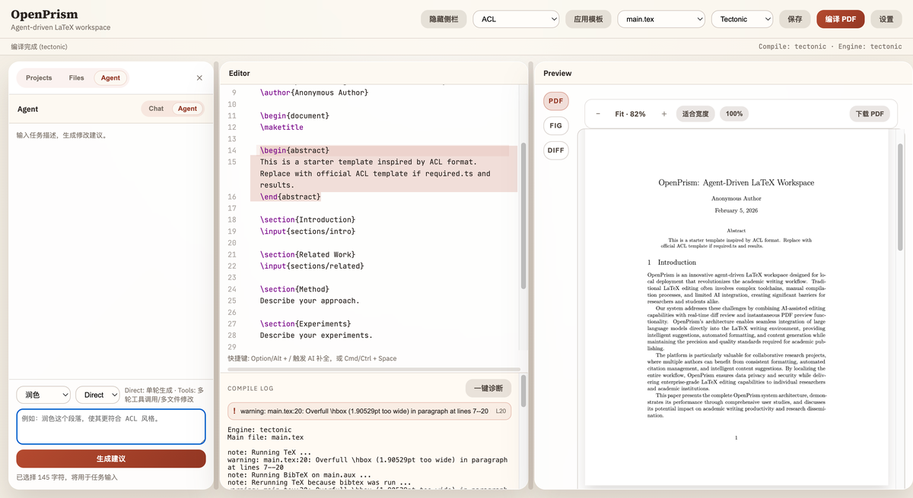
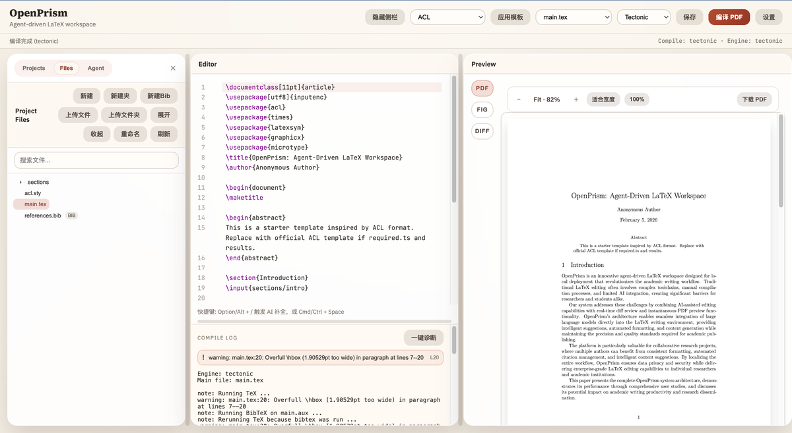
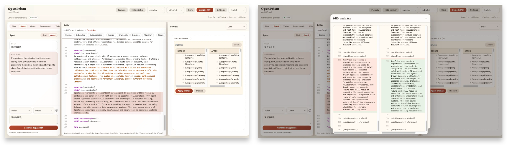
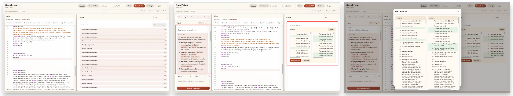
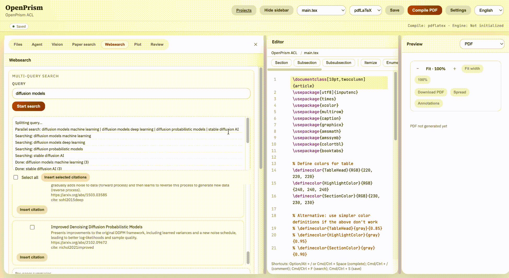
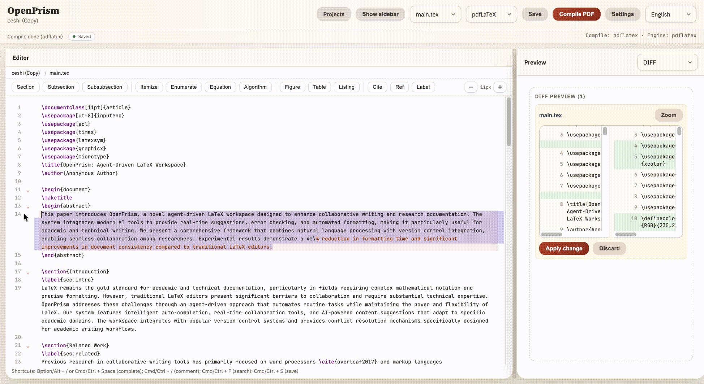
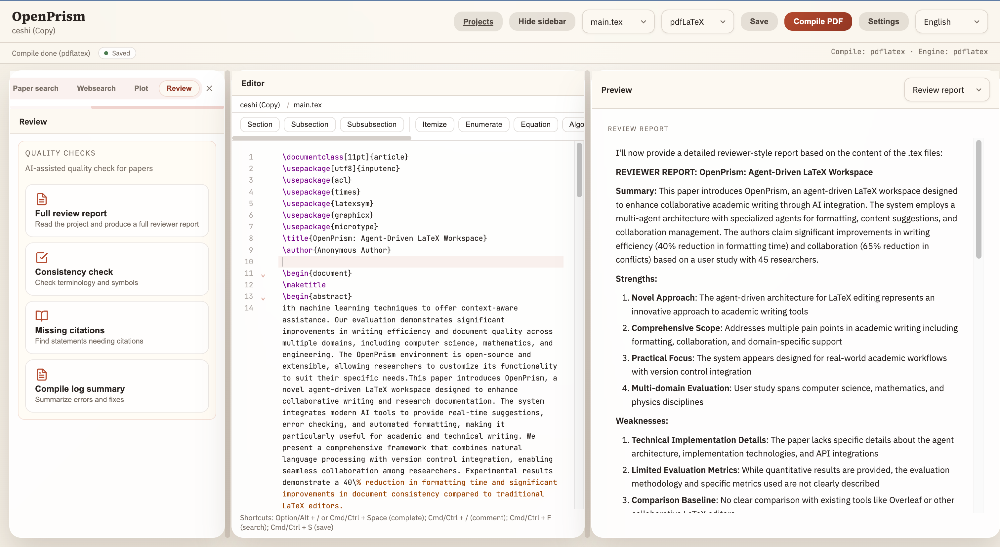
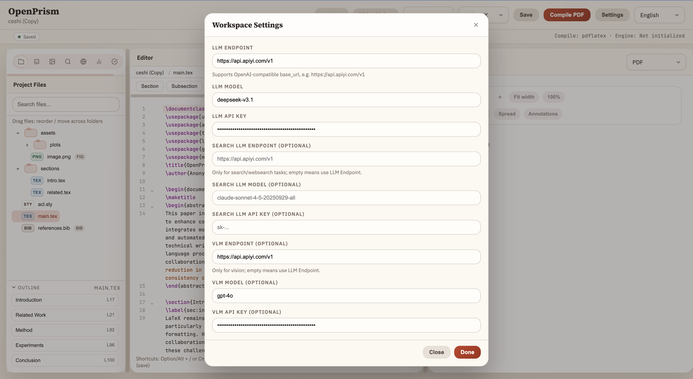

<div align="center">


# OpenPrism

### OpenPrism - 氛围写作平台

[](https://nodejs.org/)
[](LICENSE)
[](https://github.com/OpenDCAI/OpenPrism/stargazers)
[](https://github.com/OpenDCAI/OpenPrism/network/members)
[](https://github.com/OpenDCAI/OpenPrism/issues)
[](https://github.com/OpenDCAI/OpenPrism/pulls)

[中文](README_ZH.md) | [English](README.md)

---

### ✨ 核心特性一览

| 🤖 AI 智能助手 | ✍️ 编译与预览 | 📚 模板系统 |
|:---:|:---:|:---:|
| Chat / Agent 双轨历史<br>Tools 多轮工具调用 | TexLive / Tectonic / Auto<br>PDF 预览与下载 | ACL / CVPR / NeurIPS / ICML<br>模板一键切换 |

| 🔧 高级编辑 | 🗂️ 项目管理 | ⚙️ 灵活配置 |
|:---:|:---:|:---:|
| AI 自动补全 / Diff / 诊断 | 多项目管理 + 文件树 + 上传 | OpenAI 兼容端点<br>本地部署数据安全 |

| 🔍 检索能力 | 📊 图表生成 | 🧠 智能识别 |
|:---:|:---:|:---:|
| WebSearch / PaperSearch | 表格直出图表 | 公式/图表智能识别 |

| 👥 实时协作 | 📝 同行评审 | |
|:---:|:---:|:---:|
| 多人协同编辑<br>光标同步与在线管理 | AI 审稿报告 / 一致性检查<br>缺失引用 / 编译摘要 | |

---

[](#-快速开始)
[](#-核心功能)
[](#-贡献指南)
<a href="#wechat-group" target="_self">
  
</a>

</div>

## 📢 最新动态

> [!TIP]
> 🆕 <strong>2025-02 · 实时协作上线</strong><br>
> 支持多人同时编辑同一文档，基于 CRDT 实现光标同步与冲突自动解决。当前版本需要公网服务器部署，通过邀请令牌邀请远程协作者加入。

---

<div align="center">
<br>

<br>
<sub>✨ 主页面预览：三栏工作区 + 编辑器 + 预览</sub>
<br><br>
</div>

---

## ✨ 核心功能

OpenPrism 是一个面向学术写作的本地部署 LaTeX + AI 工作台，强调高效编辑、可控改动与隐私安全。

### 🤖 AI 智能助手

- **Chat 模式**：只读对话，不改文件，适合快速问答
- **Agent 模式**：生成 Diff，用户确认后应用
- **Tools 模式**：多轮工具调用，跨文件修改（如章节 + bib）
- **任务类型**：润色、改写、结构调整、翻译、自定义
- **自动补全**：Option/Alt + / 或 Cmd/Ctrl + Space 触发，Tab 接受

### ✍️ 编译与预览

- **编译引擎**：TexLive / Tectonic / Auto 自动回退
- **预览工具栏**：缩放、适合宽度、100%、下载 PDF
- **编译日志**：错误解析 + 一键诊断 + 跳转定位
- **多视图**：PDF / 图片列表 / Diff 视图

### 📚 模板系统

- **内置模板**：ACL / CVPR / NeurIPS / ICML
- **模板转换**：一键切换模板并保留正文内容

### 🗂️ 项目管理

- **多项目管理**：Projects 独立面板
- **文件树管理**：新建/重命名/删除/上传/拖拽
- **BibTeX 支持**：快速创建 references.bib

### ⚙️ 灵活配置

- **LLM Endpoint**：兼容 OpenAI API，包括自定义 base_url
- **本地存储**：设置保存在浏览器 localStorage
- **TexLive 配置**：可自定义 TexLive 资源
- **语言切换**：顶栏一键中英文切换，配置自动保存

### 🔍 检索与阅读

- **WebSearch**：联网检索与摘要
- **PaperSearch**：学术论文检索与引用信息

### 📊 图表与识别

- **表格绘图**：根据表格直接生成图表
- **智能识别**：公式与图表结构自动识别

### 📝 同行评审

- **AI 质量检查**：论文质量自动评估
- **完整审稿报告**：生成详细的 Reviewer 风格审稿意见
- **一致性检查**：术语与符号一致性检测
- **缺失引用检测**：查找需要补充引用的陈述
- **编译日志摘要**：汇总编译错误与修复建议

### 👥 实时协作

- **多人协同编辑**：多用户同时编辑同一文档，实时同步
- **光标与选区同步**：不同用户的光标以不同颜色显示，实时可见
- **在线用户列表**：协作面板展示当前在线用户及状态
- **邀请协作**：通过邀请链接或令牌邀请他人加入协作

---

## 🎨 功能展示


### 🖥️ 三栏工作区

<div align="center">
<br>

<br>
<sub>✨ 左侧 AI 助手 | 中间 LaTeX 编辑器 | 右侧 PDF 预览</sub>
<br><br>
</div>

### ✍️ 编辑页面

<div align="center">
<br>

<br>
<sub>✨ LaTeX 编辑器 + 右侧预览的同步工作流</sub>
<br><br>
</div>

### 🤖 AI 智能助手

<div align="center">
<br>

<br>
<sub>✨ Agent 模式：生成可编辑建议 + Diff 预览</sub>
<br><br>
</div>

### 🧪 一键诊断

<div align="center">
<br>

<br>
<sub>✨ 编译错误自动解析 + 定位</sub>
<br><br>
</div>

### 🌐 WebSearch

<div align="center">
<br>

<br>
<sub>✨ 联网检索与要点提炼</sub>
<br><br>
</div>

### 📄 PaperSearch

<div align="center">
<br>

<br>
<sub>✨ 论文检索与引用信息获取</sub>
<br><br>
</div>

### 📊 表格直出图表

<div align="center">
<br>

<br><sub>✨ 表格数据一键生成图表</sub>
<br><br>
</div>

### 🧠 公式/图表智能识别

<div align="center">
<br>

<br><sub>✨ 识别结构并转换为可编辑内容</sub>
<br><br>
</div>

### 🔧 AI 自动补全

<div align="center">
<br>

<br>
<sub>✨ Option/Alt + / 触发补全，Tab 接受建议</sub>
<br><br>
</div>

### 📝 同行评审

<div align="center">
<br>

<br>
<sub>✨ AI 质量检查：审稿报告 / 一致性检查 / 缺失引用 / 编译摘要</sub>
<br><br>
</div>

### 👥 实时协作

<div align="center">
<br>

<br>
<sub>✨ 多人实时协同编辑，光标同步与在线用户管理</sub>
<br><br>
</div>

---

<!-- ## 🔄 OpenPrism vs Prism 功能对比

> **Prism** 是 OpenAI 于 2026-01-27 发布的云端 LaTeX 写作平台。**OpenPrism** 是开源、可自托管的替代方案，强调隐私与数据自主。

### 📝 写作与编辑

| 功能 | OpenPrism | Prism (OpenAI) |
|:---|:---:|:---:|
| LaTeX 编辑器 | ✅ CodeMirror | ✅ 云端编辑器 |
| PDF 实时预览 | ✅ | ✅ |
| 编译引擎 | ✅ TexLive / Tectonic / Auto | ✅ 云端编译 |
| 无限项目 | ✅ | ✅ |
| 无限编译 | ✅ | ✅ |
| 编译日志解析 + 一键诊断 | ✅ | ❌ |
| Diff 视图 | ✅ | ❌ |

### 🤖 AI 能力

| 功能 | OpenPrism | Prism (OpenAI) |
|:---|:---:|:---:|
| AI 对话助手 | ✅ Chat / Agent / Tools 三模式 | ✅ GPT-5.2 对话式推理 |
| 全文档上下文理解 | ✅ | ✅ |
| 就地修改（in-place） | ✅ Diff 确认后应用 | ✅ |
| AI 自动补全 | ✅ Option/Alt + / 触发 | ❌ |
| 多轮工具调用（跨文件修改） | ✅ Tools 模式 | ❌ |
| Fix with AI | ✅ 一键诊断 | ✅ |
| 自定义 LLM 模型 | ✅ 兼容任意 OpenAI API | ❌ 仅 GPT-5.2 |

### 🔍 检索与引用

| 功能 | OpenPrism | Prism (OpenAI) |
|:---|:---:|:---:|
| 联网搜索（WebSearch） | ✅ | ✅ |
| 学术论文检索（PaperSearch） | ✅ | ✅ |
| BibTeX 管理 | ✅ | ✅ |
| Zotero 同步 | 🗺️ 规划中 | ✅ |

### 📊 多模态与图表

| 功能 | OpenPrism | Prism (OpenAI) |
|:---|:---:|:---:|
| 表格直出图表 | ✅ | ❌ |
| 公式 / 图表智能识别 | ✅ | ✅ Image to code |
| 白板 / 手写 → LaTeX | ❌ | ✅ |
| 语音编辑（Voice to code） | ❌ | ✅ |

### 📝 审稿与质量

| 功能 | OpenPrism | Prism (OpenAI) |
|:---|:---:|:---:|
| AI 质量检查 | ✅ | ✅ |
| 完整审稿报告 | ✅ Reviewer 风格 | ❌ |
| 术语 / 符号一致性检查 | ✅ | ❌ |
| 缺失引用检测 | ✅ | ❌ |
| 编译日志摘要 | ✅ | ❌ |

### 🔐 部署与隐私

| 功能 | OpenPrism | Prism (OpenAI) |
|:---|:---:|:---:|
| 部署方式 | ✅ **本地 / 内网自托管** | ❌ 仅云端 |
| 数据存储位置 | ✅ **完全本地可控** | ❌ OpenAI 云端 |
| 隐私保护 | ✅ **数据不出域** | ❌ 依赖第三方 |
| 开源 | ✅ MIT License | ❌ 闭源 |
| 实时协作 | 🗺️ 规划中（私域协作） | ✅ 无限协作者 |
| 评论批注 | 🗺️ 规划中 | ✅ |
| 会议模板系统 | ✅ ACL / CVPR / NeurIPS / ICML | ❌ |
| 模板一键转换 | 🗺️ 规划中 | ❌ |

> 💡 **总结**：Prism 依托 GPT-5.2 与云端协作提供开箱即用的体验，但数据完全托管在 OpenAI。OpenPrism 作为开源替代，支持**本地部署、私域协作、自定义模型**，适合对数据隐私和自主可控有要求的团队与个人。

--- -->

## 🚀 快速开始

### 📋 环境要求

#### 基础环境
- **Node.js** >= 18.0.0
- **npm** >= 9.0.0
- **操作系统**：Windows / macOS / Linux

#### LaTeX 编译环境（必需）

OpenPrism 需要 LaTeX 编译引擎来生成 PDF，请根据操作系统选择以下方案之一：

**方案 1：TexLive（推荐）**
- **Linux (Ubuntu/Debian)**:
  ```bash
  sudo apt-get update
  sudo apt-get install texlive-full
  ```
- **Linux (CentOS/RHEL)**:
  ```bash
  sudo yum install texlive texlive-*
  ```
- **macOS**:
  ```bash
  brew install --cask mactex
  ```
- **Windows**: 下载 [TexLive](https://www.tug.org/texlive/) 安装包

**方案 2：Tectonic（轻量级）**
- **Linux/macOS**:
  ```bash
  curl --proto '=https' --tlsv1.2 -fsSL https://drop-sh.fullyjustified.net | sh
  ```
- **Windows**: 下载 [Tectonic](https://tectonic-typesetting.github.io/) 安装包

> **注意**：TexLive 完整安装约 5-7GB，Tectonic 更轻量但功能略少。推荐 Linux 服务器使用 TexLive。

### 📦 安装与启动

#### 开发环境部署

```bash
# 1. 克隆仓库
git clone https://github.com/OpenDCAI/OpenPrism.git
cd OpenPrism

# 2. 安装依赖
npm install

# 3. 启动开发服务器（前端 + 后端）
npm run dev
```

启动后访问：
- **前端**：http://localhost:5173
- **后端**：http://localhost:8787

#### 生产环境部署

```bash
# 1. 构建前端和后端
npm run build

# 2. 启动生产服务器
npm start
```

#### Linux 服务器完整部署示例

```bash
# 1. 安装 Node.js (以 Ubuntu 为例)
curl -fsSL https://deb.nodesource.com/setup_18.x | sudo -E bash -
sudo apt-get install -y nodejs

# 2. 安装 TexLive
sudo apt-get update
sudo apt-get install -y texlive-full

# 3. 验证安装
node --version  # 应显示 >= 18.0.0
pdflatex --version  # 应显示 TexLive 版本

# 4. 克隆并部署项目
git clone https://github.com/OpenDCAI/OpenPrism.git
cd OpenPrism
npm install
npm run build

# 5. 配置环境变量（可选）
cat > .env << EOF
OPENPRISM_LLM_ENDPOINT=https://api.openai.com/v1/chat/completions
OPENPRISM_LLM_API_KEY=your-api-key
OPENPRISM_LLM_MODEL=gpt-4o-mini
OPENPRISM_DATA_DIR=/var/openprism/data
PORT=8787
EOF

# 6. 启动服务
npm start

# 7. 使用 PM2 守护进程（推荐）
sudo npm install -g pm2
pm2 start npm --name "openprism" -- start
pm2 save
pm2 startup
```

---

## ⚙️ 配置说明

### 环境变量配置

在项目根目录创建 `.env` 文件（可选）：

```bash
# LLM 配置
OPENPRISM_LLM_ENDPOINT=https://api.openai.com/v1/chat/completions
OPENPRISM_LLM_API_KEY=your-api-key
OPENPRISM_LLM_MODEL=gpt-4o-mini

# 数据存储路径
OPENPRISM_DATA_DIR=./data

# 后端服务端口
PORT=8787
```

### LLM 配置

OpenPrism 支持任何 **OpenAI 兼容**接口，包括自定义 base_url：

**方式 1：环境变量配置**
```bash
# .env 文件
OPENPRISM_LLM_ENDPOINT=https://api.openai.com/v1/chat/completions
OPENPRISM_LLM_API_KEY=sk-your-api-key
OPENPRISM_LLM_MODEL=gpt-4o-mini
```

**方式 2：前端设置面板**
- 在前端界面点击"设置"按钮
- 填写 API Endpoint、API Key 和 Model
- 配置自动保存在浏览器 localStorage

<div align="center">
<br>

<br>
<sub>✨ LLM 配置设置面板</sub>
<br><br>
</div>

**支持的第三方服务示例：**
- OpenAI: `https://api.openai.com/v1`
- Azure OpenAI: `https://your-resource.openai.azure.com/openai/deployments/your-deployment`
- 其他兼容服务: `https://api.apiyi.com/v1`

### LaTeX 编译配置

**支持的编译引擎：**
- `pdflatex` - 标准 LaTeX 引擎
- `xelatex` - 支持 Unicode 和中文
- `lualatex` - 支持 Lua 脚本
- `latexmk` - 自动化构建工具
- `tectonic` - 现代轻量级引擎

**配置方式：**
1. 在前端"设置"面板选择编译引擎
2. 设置为 "Auto" 可自动回退到可用引擎
3. 可自定义 TexLive 资源路径

### 数据存储配置

默认数据存储在 `./data` 目录，可通过环境变量修改：

```bash
# 自定义数据目录
OPENPRISM_DATA_DIR=/var/openprism/data
```

**目录结构：**
```
data/
├── projects/           # 用户项目
│   ├── project-1/
│   │   ├── main.tex
│   │   └── references.bib
│   └── project-2/
└── templates/          # 模板缓存
```

---

## 👥 协作模式使用指南

OpenPrism 内置基于 CRDT（Yjs）+ WebSocket 的实时协作系统，支持多人同时编辑同一文档，无需第三方服务。

### 协作环境变量

在 `.env` 中添加以下配置：

```bash
# 令牌签名密钥（生产环境务必修改）
OPENPRISM_COLLAB_TOKEN_SECRET=your-secure-random-string

# 是否强制令牌验证（默认 true，本地开发可设为 false）
OPENPRISM_COLLAB_REQUIRE_TOKEN=true

# 令牌有效期，单位秒（默认 86400 = 24 小时）
OPENPRISM_COLLAB_TOKEN_TTL=86400
```

### 使用步骤

1. **部署服务**：将 OpenPrism 部署到有公网 IP 的服务器，配置域名与 HTTPS
2. **生成邀请**：在编辑页面的协作面板中点击「生成邀请链接」
3. **分享链接**：将生成的链接发送给协作者
4. **加入协作**：协作者打开链接，令牌自动验证后进入编辑器
5. **实时编辑**：多人光标实时可见，编辑内容自动同步，冲突自动解决

<details>
<summary><strong>Nginx 反向代理配置（推荐，适合有公网服务器）</strong></summary>

协作依赖 WebSocket，Nginx 需要配置升级头：

```nginx
server {
    listen 443 ssl;
    server_name your-domain.com;

    location / {
        proxy_pass http://127.0.0.1:8787;
        proxy_http_version 1.1;
        proxy_set_header Upgrade $http_upgrade;
        proxy_set_header Connection "upgrade";
        proxy_set_header Host $host;
    }
}
```

> **提示**：本地访问（127.0.0.1）默认免令牌验证，适合本地开发调试。

</details>

<details>
<summary><strong>无公网服务器？使用内网穿透（ngrok）</strong></summary>

没有公网服务器也可以远程协作，OpenPrism 内置了隧道支持，一条命令即可将本地服务暴露到公网。

#### 快速开始（ngrok，推荐）

1. 注册 [ngrok](https://dashboard.ngrok.com/get-started/your-authtoken) 免费账号，获取 authtoken
2. 运行以下命令：

```bash
export NGROK_AUTHTOKEN=your_token_here

npm run tunnel:ngrok
```

3. 启动后终端会输出公网 URL，将该 URL 发给协作者即可：

```
  OpenPrism started at http://localhost:8787

  Tunnel active (ngrok):
  Public URL: https://xxxx.ngrok-free.app
  Share this URL to collaborate remotely!
```

4. 协作者在浏览器打开该 URL，即可实时协作编辑

#### 其他隧道方案

| 方案 | 命令 | 说明 |
|------|------|------|
| localtunnel | `npm run tunnel` | 零配置，但可能不稳定 |
| Cloudflare Tunnel | `npm run tunnel:cf` | 需安装 [cloudflared](https://developers.cloudflare.com/cloudflare-one/connections/connect-apps/install-and-setup/installation/) |

> **注意**：隧道默认关闭，普通 `npm start` 不会创建隧道。也可通过环境变量手动指定：`OPENPRISM_TUNNEL=ngrok npm start`

</details>

---

## 🎯 使用指南（简版）

1. **创建项目**：在 Projects 面板新建项目并选择模板
2. **编写论文**：在 Files 树中编辑 LaTeX
3. **AI 修改**：切换 Agent / Tools，生成 diff 并确认应用
4. **编译预览**：点击“编译 PDF”，在右侧预览
5. **导出 PDF**：在预览工具栏点击“下载 PDF”

---

## 📁 项目结构

```
OpenPrism/
├── apps/
│   ├── frontend/              # React + Vite 前端
│   │   ├── src/
│   │   │   ├── app/App.tsx     # 主应用逻辑
│   │   │   ├── api/client.ts   # API 调用
│   │   │   └── latex/          # TexLive 集成
│   └── backend/               # Fastify 后端
│       └── src/index.js        # API / 编译 / LLM 代理
├── templates/                 # LaTeX 模板（ACL/CVPR/NeurIPS/ICML）
├── data/                      # 项目存储目录（默认）
└── README.md
```

---

## 🗺️ Roadmap

<table>
<tr>
<th width="35%">功能</th>
<th width="15%">状态</th>
<th width="50%">说明</th>
</tr>
<tr>
<td><strong>👥 私域协作编辑</strong></td>
<td></td>
<td>多人实时协同编辑，光标同步与在线用户管理（当前需公网服务器部署）</td>
</tr>
<tr>
<td><strong>🌐 无服务器协作</strong></td>
<td></td>
<td>支持无公网服务器的本地协作：① 内置内网穿透集成（ngrok / Cloudflare Tunnel）一键暴露本地服务；② 基于 WebRTC 的 P2P 点对点直连，数据不经第三方中转</td>
</tr>
<tr>
<td><strong>🔍 增强 WebSearch</strong></td>
<td></td>
<td>增强联网检索能力，接入第三方 Search API（如 Google / Baidu / SerpAPI），提升搜索质量与覆盖范围</td>
</tr>
<tr>
<td><strong>📚 会议模板一键转换</strong></td>
<td></td>
<td>支持不同会议模板间快速转换（如 ACL → NeurIPS），方便转投，保留正文内容与格式</td>
</tr>
<tr>
<td><strong>📸 版本快照与回滚</strong></td>
<td></td>
<td>项目版本管理，支持快照保存与一键回滚</td>
</tr>
<tr>
<td><strong>📖 引用检索助手</strong></td>
<td></td>
<td>自动检索相关文献并生成 BibTeX 引用</td>
</tr>
</table>

---

## 🤝 贡献指南

欢迎提交 Issue 或 PR：
1. Fork 仓库
2. 新建分支
3. 提交变更
4. 发起 PR

开发命令：
```bash
npm run dev
npm run dev:frontend
npm run dev:backend
npm run build
```

---

## 📄 开源协议

MIT License. See [LICENSE](LICENSE).

---

## 🙏 致谢

- Tectonic
- CodeMirror
- PDF.js
- LangChain
- React / Fastify

<div align="center">

**如果这个项目对你有帮助，请给我们一个 ⭐️ Star！**

[](https://github.com/OpenDCAI/OpenPrism/stargazers)
[](https://github.com/OpenDCAI/OpenPrism/network/members)

<br>

<a name="wechat-group"></a>

<br>
<sub>扫码加入微信交流群</sub>

<p align="center">
  <em>Made with ❤️ by OpenPrism Team</em>
</p>

</div>
